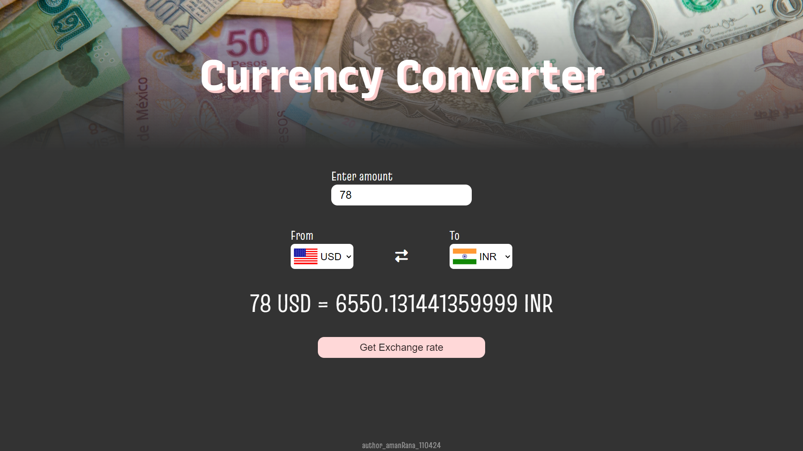

# Currency Converter

A simple static website to convert different currencies based on user input. The project is built with HTML, CSS, and JavaScript.
   

## Features

- Converts input amounts between various currencies.
- User-friendly interface with an intuitive design.
- Real-time conversion with JavaScript logic.
   

## Live Demo

Check out the live demo at: [Live demo](https://amanranahere.github.io/Currency-Converter/)
   

## Usage
- Enter the amount you wish to convert.
- Select the currencies you want to convert from and to.
- Click the "Get Exchange Rate" button to see the result.
     

## Built With

- HTML - For the structure of the site.
- CSS - For styling and layout.
- JavaScript - For currency conversion logic.
   

## Acknowledgements

- Exchange rate data is provided by **`@fawazahmed0/currency-api`**.
- Country flags are sourced from **`FlagsAPI`** using `https://flagsapi.com/${countryCode}/flat/64.png`.
- Inspiration from various online tutorials and documentation.
   

## Screenshot

